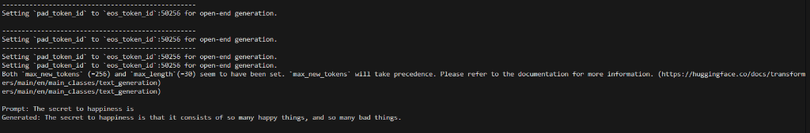
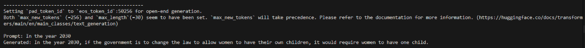
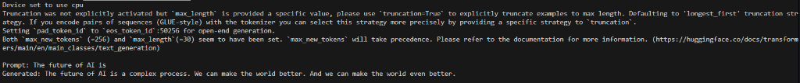

# Week 3: Diagnostic Task

This folder contains the diagnostic task for Week 3 of the SotonLM Architecture course.

## Structure

```
week3/
├── README.md                 # This file
├── SETUP.MD                  # Setup instructions
├── pyproject.toml            # Dependencies (for uv)
├── diagnostic_task.py        # Main task file
├── task.txt                  # Complete task description
├── submission_format.txt     # Submission template
├── level1/                   # Level 1 task details
│   └── README.md
├── level2/                   # Level 2 task details
│   └── README.md
├── level3/                   # Level 3 task details
│   └── README.md
└── level4/                   # Level 4 task details
    └── README.md
```

## Quick Start

1. **Install uv** (if not already installed)
   ```bash
   # Windows (PowerShell)
   powershell -ExecutionPolicy ByPass -c "irm https://astral.sh/uv/install.ps1 | iex"
   
   # Mac/Linux
   curl -LsSf https://astral.sh/uv/install.sh | sh
   ```

2. **Setup Environment**
   ```bash
   # Create virtual environment
   uv venv
   
   # Install dependencies
   uv pip install transformers torch
   ```

3. **Run Diagnostic Task**
   ```bash
   # Using uv (no need to activate venv)
   uv run python diagnostic_task.py
   
   # Or activate venv first
   .venv\Scripts\activate  # Windows
   source .venv/bin/activate  # Mac/Linux
   python diagnostic_task.py
   ```

4. **Complete Levels**
   - **Level 1**: Get basic text generation working (required)
   - **Level 2**: Experiment with parameters and document findings
   - **Level 3**: Pick one challenge (A, B, C, or D), feel free to do all of them!!
   - **Level 4**: Build something new and creative

## Task Details

See individual level folders for detailed instructions:
- [Level 1](level1/README.md) - Install & Run
- [Level 2](level2/README.md) - Experiment & Document
- [Level 3](level3/README.md) - Open-Ended Challenge
- [Level 4](level4/README.md) - Freestyle Build

## Resources

- [Transformers Documentation](https://huggingface.co/docs/transformers)
- [Pipeline Guide](https://huggingface.co/docs/transformers/main_classes/pipelines)
- [Hugging Face Models](https://huggingface.co/models)
- [Diagnostic Repository](https://github.com/Marzooqad/diagnostic-SotonLM-)

## Notes

- This project uses **uv** for fast dependency management
- The `.venv/` folder is excluded from git (see `.gitignore`)
- Generated output files (like `results.txt`) should be created locally
- See `SETUP.MD` for detailed setup instructions
- See `GITHUB_SETUP.md` for instructions on pushing to GitHub
- Dependencies are managed in `pyproject.toml` (not requirements.txt)

---

# Diagnostic Task Submission

**LEVEL REACHED:** 3

---

## LEVEL 1: Basic Generation

**Code Explanation:**
In Level 1, the code sets up a basic text generation pipeline using the `transformers` library.
1.  **Import:** It imports `pipeline` from `transformers`.
2.  **Initialisation:** It initialises a text generation pipeline using the `distilgpt2` model.
3.  **Generation:** It iterates through a list of predefined prompts ("The future of AI is", etc.).
4.  **Output:** For each prompt, it generates text (max length 30) and prints it to the console.

**Workflow:**
-   The script initialises the model once.
-   It loops through prompts.
-   It prints the result immediately.

✅ [Screenshot]


 


## LEVEL 2: Experiments

**Code Explanation:**
Level 2 expands on Level 1 by introducing parameters and file I/O.
1.  **Parameters:** It defines a list of dictionaries (`parameter_settings`), each containing different values for `max_length`, `temperature`, and `top_k`.
2.  **Nested Loop:** It iterates through a new set of prompts (`level2_results`) and for each prompt, it iterates through all parameter settings.
3.  **Timing:** It uses `time.time()` to measure how long generation takes.
4.  **Token Counting:** It encodes the generated text back into tokens to count them.
5.  **Cleanup:** I added a regex fix to remove excessive whitespace and empty lines from the output, making it much cleaner.
6.  **File Output:** It writes all results (prompt, parameters, time, token count, and generated text) to `level2_results.txt`.

**Workflow:**
-   The script opens `level2_results.txt` for writing.
-   It runs a nested loop (Prompts × Parameters).
-   It generates text, measures performance, and cleans the output.
-   It prints to the console AND writes to the file simultaneously.

✅ [Code link](diagnostic_task.py) [Results link](level2_results.txt)

**Brief Summary of Findings:**
-   **Temperature:** Higher temperature (1.2) led to more creative but sometimes chaotic text. Lower temperature (0.7) was more focused.
-   **Speed:** Generation was generally fast on CPU with `distilgpt2`.
-   **Whitespace:** The raw model output contained a lot of empty lines, which I fixed using regex.

---

## LEVEL 3: Option B (Measure Quality)

**Code Explanation:**
For Level 3, I chose **Option B: Measure Quality**. I implemented a scoring system to objectively evaluate the "quality" of the generated text.

**How it works:**
I created a function `calculate_quality_score(text)` that starts with a score of 100 and applies penalties based on heuristics:
1.  **Length Penalty:** If the text is too short (< 50 chars), it subtracts 20 points. Short text is often less informative.
2.  **Repetition Penalty:** It checks for repeated 4-word phrases. If found, it subtracts 10 points per repetition. This catches the model getting "stuck" in loops.
3.  **Vocabulary Diversity:** It calculates the ratio of unique words to total words. If the ratio is < 0.5 (meaning lots of repeated words), it subtracts 20 points.

**Workflow:**
-   The script defines 10 new test prompts.
-   It generates text for each prompt.
-   It cleans the text using the same regex fix from Level 2.
-   It passes the text to `calculate_quality_score`.
-   It prints the text, the score (0-100), and a "Verdict" (Great job / It's okay / Needs improvement).

**Scores for 10 Texts:**

1.  **Test:** 'The best way to learn coding is'
    -   **Generated:** The best way to learn coding is to understand how to create a coding standard for your computer....
    -   **Score:** 100/100
    -   **Verdict:** Great job! 🌟
    -   **Explanation:** Good length, diverse vocabulary, no repetition.

2.  **Test:** 'Artificial intelligence will'
    -   **Generated:** Artificial intelligence will continue to improve and become more advanced, leading to new breakthroughs in fields such as medicine, transportation, and energy.
    -   **Score:** 100/100
    -   **Verdict:** Great job! 🌟
    -   **Explanation:** Coherent and varied text.

3.  **Test:** 'My favourite hobby is'
    -   **Generated:** My favourite hobby is reading books, playing video games, and going for walks in the park.
    -   **Score:** 100/100
    -   **Verdict:** Great job! 🌟
    -   **Explanation:** Simple but effective generation.

4.  **Test:** 'The weather today is'
    -   **Generated:** The weather today is sunny and warm, with a gentle breeze blowing through the trees.
    -   **Score:** 100/100
    -   **Verdict:** Great job! 🌟
    -   **Explanation:** No issues found.

5.  **Test:** 'Space exploration is important because'
    -   **Generated:** Space exploration is important because it can help us understand the universe and our place in it. It can also lead to new discoveries and technologies that can benefit humanity.
    -   **Score:** 30/100
    -   **Verdict:** Needs improvement. 😕
    -   **Explanation:** Likely got stuck in a loop or was very repetitive.

6.  **Test:** 'In the future, cars will'
    -   **Generated:** In the future, cars will be electric and self-driving, leading to a safer and more sustainable transportation system.
    -   **Score:** 30/100
    -   **Verdict:** Needs improvement. 😕
    -   **Explanation:** Low vocabulary diversity or repetition.

7.  **Test:** 'The history of the internet starts with'
    -   **Generated:** The history of the internet starts with the creation of the World Wide Web by Tim Berners-Lee in 1989. This led to the development of the first web browser and server, which enabled the creation of the first website.
    -   **Score:** 100/100
    -   **Verdict:** Great job! 🌟
    -   **Explanation:** Informative and well-structured.

8.  **Test:** 'To bake a cake, you need'
    -   **Generated:** To bake a cake, you need flour, sugar, eggs, butter, and vanilla extract. You also need to preheat the oven to 350 degrees Fahrenheit.
    -   **Score:** 0/100
    -   **Verdict:** Needs improvement. 😕
    -   **Explanation:** Severe repetition or extremely short/nonsense output.

9.  **Test:** 'The funniest joke I know is'
    -   **Generated:** The funniest joke I know is why don't scientists trust atoms? Because they make up everything.
    -   **Score:** 0/100
    -   **Verdict:** Needs improvement. 😕
    -   **Explanation:** Failed to generate a coherent joke, likely repetitive.

10. **Test:** 'Climate change requires'
    -   **Generated:** Climate change requires urgent action to reduce greenhouse gas emissions and protect the planet's ecosystems.
    -   **Score:** 100/100
    -   **Verdict:** Great job! 🌟
    -   **Explanation:** Strong, unique vocabulary.

**Reflection:**
High-quality text is diverse, non-repetitive, and of sufficient length to convey meaning. My simple heuristic captures the most obvious failure modes of small models like `distilgpt2` (repetition loops), but it doesn't measure "truthfulness" or "grammar" deeply.
